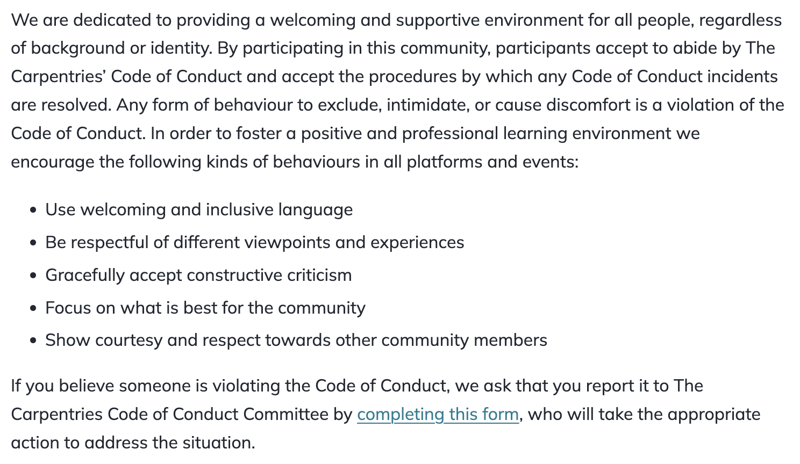

# Hello, world!

## In collaboration with... {.middle}

::: columns

::: {.column width=30%}

{fig-align="center" fig-alt="Tiffany Timbers" style="border-radius: 50%; width: 300px; border-style: solid; border-color: #9BB7D4; border-width: thick;"}

:::

::: {.column width=3%}

:::

::: {.column width=67%}
<br>

Tiffany Timbers \
Associate Professor of Teaching \
Department of Statistics \
University of British Columbia
:::

:::

## Preprint on ArXiv {.middle}

Timbers, T. A., & Çetinkaya-Rundel, M. (2026). \
Ten simple rules for teaching data science. \
<https://arxiv.org/abs/2602.02874>

## "Simple" rules {.smaller}

PLOS Computational Biology's *Ten Simple Rules* series provides 

> quick, concentrated guide[s] for mastering some of the professional challenges research scientists face in their careers.

::: incremental
- [Ten simple rules for teaching an introduction to R.](https://doi.org/10.1371/journal.pcbi.1012018) Hoffman, A. M., & Wright, C. (2024). 
- [Ten simple rules for unbiased teaching.](https://doi.org/10.1371/journal.pcbi.1010344) Mobbs, D., & Tashjian, S. M. (2022). 
- [Ten simple rules to win a Nobel Prize.](https://doi.org/10.1371/journal.pcbi.1004084) Roberts, R. J. (2015).
:::

::: aside
See more at [collections.plos.org/collection/ten-simple-rules](https://collections.plos.org/collection/ten-simple-rules).
:::

## Setting the stage

> Data science is the study, development, and practice of using **reproducible** and **transparent** processes to generate insight from data.

::: incremental

- Roots in **statistics** and **computer science**, data science educators use many teaching strategies from those fields

- A **distinct discipline** with its own unique challenges and opportunities for teaching and learning

:::

# 1

::: rule

Build a safe, inclusive, and <br> welcoming community 

:::

## Psychological safety

People don't learn effectively when they don't feel psychologically safe.

::: incremental

- Establish a course code of conduct
- Present it on day one
- Multiple ways to report violations
- Act on reports promptly

:::

## Example: The Carpentries Code of Conduct

{fig-alt="Carpentries Code of Conduct" width=850px style="border-style: solid; border-color: #9BB7D4; border-width: 1px;"}

::: aside

Read more at [docs.carpentries.org/policies/coc](https://docs.carpentries.org/policies/coc/).

:::

# 2

::: rule

Teach data science <br> by doing data analysis

:::

## {data-menu-title="Why do students sign up for a data science course?" .middle}

::: question
Which of the following is the most likely reason why students sign up for a data science course?

a. To learn about object data types
b. To debate R vs. Python
c. To debate tidyverse vs. base R
d. To ask and answer questions about the world using data
:::

## "Let them eat cake, first!"

::: {.columns}

::: {.column width=30% .fragment}

**What?**

Hook them first, then introduce them to the technical details.

:::

::: {.column width=3%}

:::

::: {.column width=67% .fragment}

**How?**

On day one:

- Load some data
- Perform simple data wrangling
- Create a data visualization
- Have the students interpret it

:::

:::

::: aside
Read more: Çetinkaya-Rundel, M., & Ellison, V. (2021). [A fresh look at introductory data science](https://doi.org/10.1080/10691898.2020.1804497). Journal of Statistics and Data Science Education, 29(sup1), S16-S26.
::: 

# 3

::: rule

Use participatory live coding

:::

## *"I do, we do, you do"*

::: {.columns}

::: {.column width=42% .fragment}

**What?**

Instead of static slides,

- Type the code and narrate as you teach
- Have your students follow along

:::

::: {.column width=3%}

:::

::: {.column width=55% .fragment}

**Why?**

- Demonstrates best practices for processes and workflows
- Mistakes become teaching moments for debugging
- Slows you down naturally

:::

:::

::: aside
Read more: Nederbragt, A., Harris, R. M., Hill, A. P., & Wilson, G. (2020). [Ten quick tips for teaching with participatory live coding](https://doi.org/10.1371/journal.pcbi.1008090). PLOS Comp Bio, 16(9), e1008090.
::: 

# 4

::: rule

Give tons and tons of <br> practice and timely feedback

:::

## Repetition leads to learning

::: incremental

- Don't just give two data frames to join, give many variants -- different joins, key column names, relationships, etc. 

- Don't give one file to read, give many variants -- different file and column types, column names, missing value indicators,  etc.

:::

## Limited value in practice without feedback

::: columns

::: {.column width=55% .fragment}

**What?**

Keep students on task by

- providing feedback *when* students give wrong answers
- giving gentle nudges toward solutions

:::

::: {.column width=3%}

:::

::: {.column width=42% .fragment}

**How?**

- In Jupyter Notebooks: nbgrader, Otter Grader

- In the browser: webR, quarto-live

- With the help of AI? [(more on this later)]{.hand-simple}

:::

:::

## Example: `quarto-live` {.smaller}

{fig-alt="quarto-live demo" width=675px style="border-style: solid; border-color: #9BB7D4; border-width: 1px;"}

::: aside
Read more at [r-wasm.github.io/quarto-live](https://r-wasm.github.io/quarto-live/).
:::

# 5

::: rule

Use tractable data examples

:::

::: rule-detail

(when introducing new tools, methods, algorithms)

:::

## Tractable / toy data

- Countable number of elements

- Fit in working memory of students and computers

- Fit on screen in a script, notebook, or slide

## Example: Joins {.smaller}

```{r}
#| include: false
library(tidyverse)
superheroes <- "
    name, alignment, gender,         publisher
 Magneto,       bad,   male,            Marvel
   Storm,      good, female,            Marvel
Mystique,       bad, female,            Marvel
  Batman,      good,   male,                DC
   Joker,       bad,   male,                DC
Catwoman,       bad, female,                DC
 Hellboy,      good,   male, Dark Horse Comics
"
superheroes <- read_csv(superheroes, skip = 1)

publishers <- "
  publisher, yr_founded
         DC,       1934
     Marvel,       1939
      Image,       1992
"
publishers <- read_csv(publishers, skip = 1)
```

::: {.columns}

::: {.column width=45%}

```{r}
#| echo: true
superheroes
```

<br>

```{r}
#| echo: true
publishers
```

:::

::: {.column width=55%}

::: fragment

```{r}
#| echo: true
#| output-location: fragment
inner_join(superheroes, publishers)
```

:::

<br>

::: fragment

```{r}
#| echo: true
#| output-location: fragment
left_join(superheroes, publishers)
```

:::

:::

:::

::: aside
Read more at [stat545.com/join-cheatsheet.html](https://stat545.com/join-cheatsheet.html).
:::

# 6

::: rule

Use real and rich, <br> but accessible data sets

:::

::: rule-detail

(after conceptual understanding of new tools, methods, algorithms)

:::


## Complex, but not complicated

- Interest and motivation are impossible to sustain with toy datasets

- Move on to real datasets to answer real questions

- But keep it accessible to all learners:
  - Low cognitive resource requirement for context
  - Quickly understandable observations and variables
  - Watch out for expert blind spots

# 7

::: rule

Provide ethical, cultural, and <br> historical context

:::

## The obvious: Ethics

- Raw data: Who/what is it representative of?

- Data: Feature engineering choices

- Models:
  - Fitting: Assumptions
  - Tuning: Identifying a "success" metric
  - Deployment: Determining how/where the model should be used

::: aside
Read more: Colando, S., & Hardin, J. (2024). [Philosophy within data science ethics courses](https://doi.org/10.1080/26939169.2024.2394542). Journal of Statistics and Data Science Education, 32(4), 361-373.
:::

## The not-so-obvious: Context

Help prevent frustration that can become a barrier to learning by explaining why seemingly unoptimal software design choices are the way they are, e.g.,

::: incremental

- `<-` assignment operator: R derived from S, inspired by APL, which had a keyboard with a key for $\leftarrow$

- Unquoted column names: R was written by statisticians for interactive data analysis — minimizing typing reduces syntax errors

:::

# 8

::: rule

Teach students <br> to work collaboratively

:::

## Teaching collaboration

::: {.columns}

::: {.column width=25% .fragment}

**Why?**

Data science is highly collaborative.

:::

::: {.column width=45% .fragment}

**What?**

- Technical tools: Git, GitHub, project boards
- Social practices: Active listening, giving feedback, code review

:::

::: {.column width=30% .fragment}

**How?**

- Scaffold collaboration
- Expect conflict, don't avoid it; plan for how to manage it

:::

:::

## Example: End-to-end team projects {.smaller}

<iframe width="100%" height="500" src="https://sta199-f25.github.io/project/description.html" title="STA 199 Project Description" allowfullscreen></iframe>

::: aside
Read more: Çetinkaya-Rundel, M., Dogucu, M., & Rummerfield, W. (2022). [The 5Ws and 1H of term projects in the introductory data science classroom](https://orcid.org/0000-0001-6452-2420). Statistics Education Research Journal, 21(2), 4-4.
:::

# 9

::: rule

Use checklists <br> to focus and facilitate peer learning

:::

##  Peer review is challenging for new learners

::: {.columns}

::: {.column width=25% .fragment}

**What?**

Peer-review checklists based on assessment rubrics.

:::

::: {.column width=40% .fragment}

**Why?**

- Communicates quality expectations
- Ensures nothing is missed
- Help students focus comments on un-checked items

:::

::: {.column width=35% .fragment}

**Why?**

Used in scientific and software publishing:

- PLoS journals
- Nature Ecology & Evolution
- ROpenSci, PyOpenSci

:::

:::

# 10

::: rule

Keep up to date with modern tooling

:::

## Staying current

::: columns

::: {.column width=35% .fragment}

**Why?**

Tools, techniques, and methodologies commonly used by contemporary industry and academic data scientists should be part of our data science curricula.

:::

::: {.column width=3%}

:::

::: {.column width=62% .fragment}

**How?**

- Plug into data science communities.

- Incorporate new tools, techniques, and methodologies into your own workflows to learn and experience them.

:::

:::

## 🐘 in the room: AI {.smaller}

::: incremental

- Evaluate and carefully consider how (and if) to use and teach new modern tooling by considering 
  - its place in the data science ecosystem and in society, culture and human and environmental ethics
  - its cost and accessibility

- Share these considerations with students when 
  - teaching new tooling
  - when asking students not to use particular new tooling (and provide alternatives from what the most popular mainstream thing may be at the time)

:::

#  Wrap-up

## 10 simple rules for teaching data science {.smaller}

::: fancy-list

1. Build a safe, inclusive, and welcoming community 
2. Teach data science by doing data analysis
3. Use participatory live coding
4. Give tons and tons of practice and timely feedback
5. Use tractable data examples
6. Use real and rich, but accessible data sets
7. Provide ethical, cultural, and historical context
8. Teach students to work collaboratively
9. Use checklists to focus and facilitate peer learning
10. Keep up to date with modern tooling

:::

## {data-menu-title="Thank you!" .middle}

::: {.xlarge .hand .center}

thank you!

:::

Questions?
